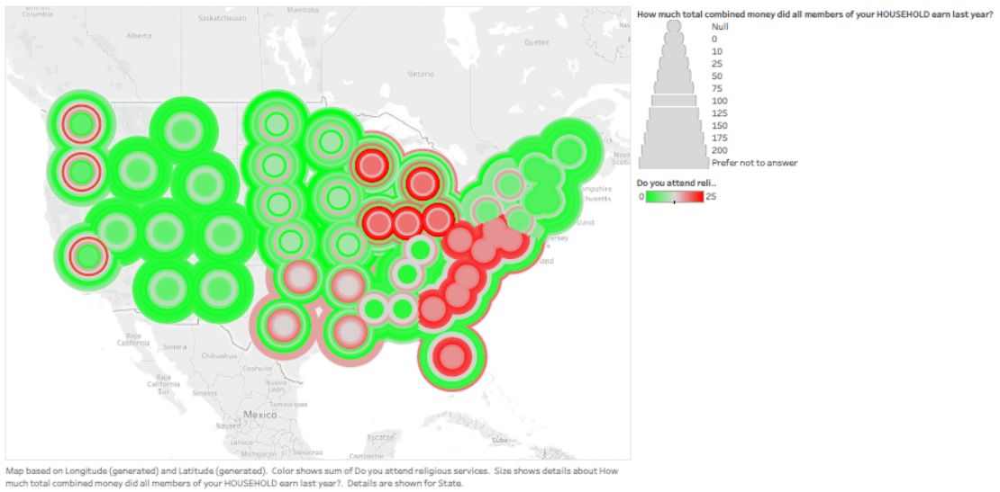
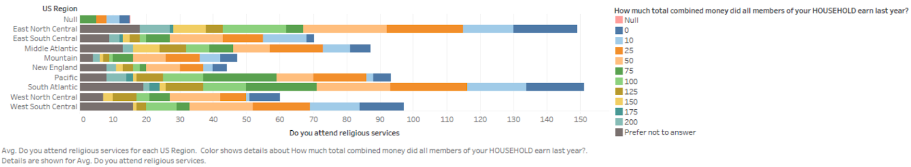

# Design Manifesto
This is my Design Manifesto website for my Human Computer Interaction course at Worcester Polytechnic Institute.
Here I will display the final results of the assignments I was assigned as part of the afformentioned Human Computer Interaction Course.

## About Me...
My name is Jacob Remz and I am currently a junior at Worcester Polytechnic Institute taking [CS3041 Human Computer Interaction](https://cs3041-18d.github.io/) as taught by professor [Lane Harrison](https://web.cs.wpi.edu/~ltharrison/).

## Design Portfolio
Professor Harrison has structured CS3041 as a series of one week design sprints in which groups of students are expected to produce material focused around that weeks theme. I have choosen four of these one week assignments to highlight as examples of different aspects of my design process. The following are links with images and short desriptions of each of the four one week assignments.

### [Design For Others](https://medium.com/@john3r8amaral/design-for-others-3dfa42f7211c)
 

The goal of this projet was to redesign a local organizations website for mobile while keeping in mind a specific target demographic. We decied on redeisigning a local makerspaces, Technicopia, website and our demographic was "people in their 20s." The origional version of the website can be found [here](http://technocopia.org/) and the redesigned version of the site can be found [here](https://projects.invisionapp.com/share/QFGHPYV2ZK5). This project is a good example of the use of the *Wizard of Oz* technique because we utilized [Invision](https://www.invisionapp.com/) to stitch together images and to provide the small amounts of interaction we needed to fake a somewhat functional website. 

### [Design For Understanding](https://medium.com/@mariana0pachon/religiousness-and-income-of-us-regions-327de34debbd)

This project was a data visualization exersize and is a great example of that very thing. As a group we were responsible for two sets of visualizations. The first set of visualizations was intended to persuade the reader of something by presenting the information in a unique and interesting way, the second set was supposed to present the data in an impartial matter via easily interpreted and readable visualizations. For this assignment I was part of the subteam responsible for the second set of data visusalizations and to accomplish our goal we used the data visualization tool [Tableau](https://www.tableau.com/). Tableau allowed for us to easily (after a learning curve) create visualizations that facilitated viewers abilities to quickly interpret the differances that exist within the dataset we used.

### [Design For Tension](https://medium.com/@michaelbosik/design-for-tension-group-13-e49fcef641b2)
### [Design For Wellbeing](https://medium.com/@pawandodani/design-for-wellbeing-163aeea0f2ff)
